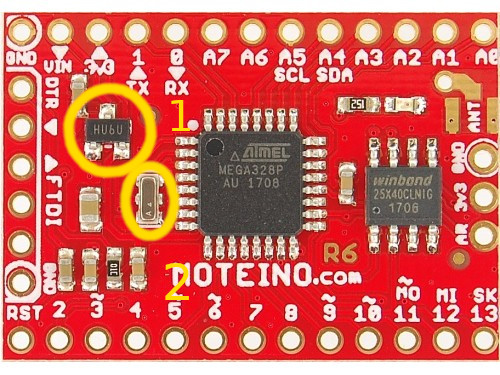
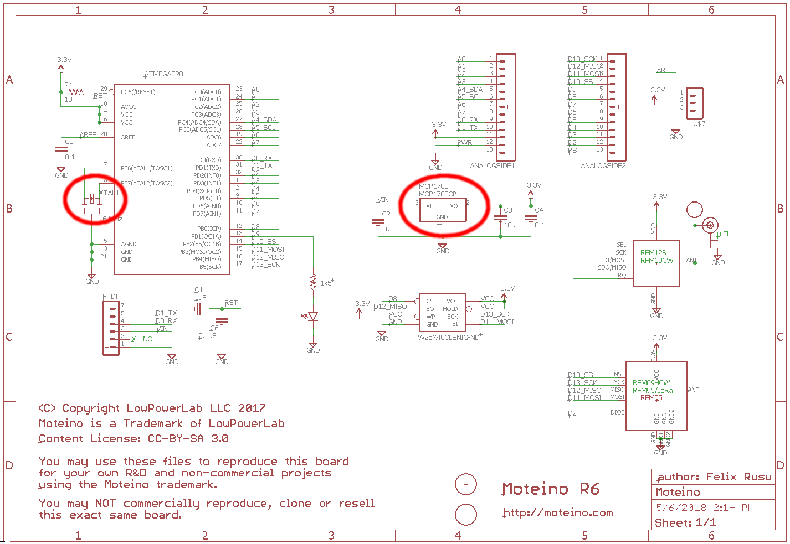
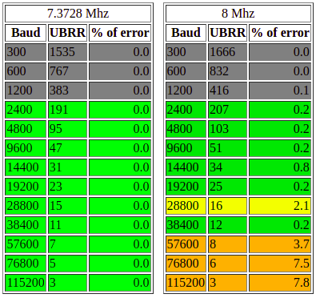

# IoTs RF Core Library

## Requirements

- low power consumption (battery powered devices):
  - voltage range is from 2.4V to 3.3V,
  - BOD below 1.8V,
  - deep sleep modes: 
    - for some amount of time,
    - forever until interrupt,
- possibility of connecting various peripheral devices,
- send data to `gateway`,
- receive data from `gateway`,
- measure battery percent


## Hardware

### Circuit

Hadrware configuration is based on `Moteino R6` board referenced [here](https://lowpowerlab.com/shop/product/99). It is `Atmega328p` onboard. Board integrates `RFM69` radio modules. There are two variations of these modules: `5V/16MHz` and `3.3V/8MHz`. Unfortunately internal `8MHz` oscillator is inaccurate and sometimes serial communication issues occurs, especially with bootloader data exchange.





Solution for above issues is to remove voltage regulator pointed in circle 1 and replace external 16MHz oscillator to `7,3628MHz` UART friendly frequency. For `8MHz` frequency with baud rate `57600` which is default value of `Optiboot` bootloader, error is about 3.7%. When baud is switched to `38400` situation is better but still not perfect. Error is about 0.2% and it depends on temperature of AVR controller. When external 7,3628MHz is used then frequency is really stable and UART error is 0%. That is the best situation.



For IoTs RF Core external oscillator is replaced to `7,3628MHz` and voltage regulator is removed and missing connections are jumped. Before this modification (with 8MHz internal oscillator) programming by FTDI adapter wasn't possible on 4 from 20 boards. Communication wasn't reliable. After misidifactions communication is 100% reliable and all boards were flashed sucessfully.

### Bootloader

As Bootloader default `Arduino` [optiboot](https://github.com/Optiboot/optiboot) is used. Binary needs to be build referring to previous frequency changes by following command:

```
make AVR_FREQ=7372800L BAUD_RATE=115200 atmega328
```

In the end following `platformio` configuration is used for flash fuses and bootloader:

```
[env:bootloader]
platform = atmelavr
board = moteino8mhz
framework = arduino
upload_protocol = usbasp
;Ext. Crystal Osc.; Frequency 3.0-8.0 MHz; Start-up time PWRDWN/RESET: 1K CK /14 CK + 4.1 ms; [CKSEL=1100 SUT=11] 
board_fuses.lfuse = 0xFC
board_fuses.hfuse = 0xDC
board_fuses.efuse = 0xFE
board_bootloader.lfuse = 0xFC
board_bootloader.hfuse = 0xDC
board_bootloader.efuse = 0xFE
;Bootloader file HEX
board_bootloader.file = bootloaders/optiboot_7370000hz_115200b_atmega328.hex
```

## Configuration

Configuration is an interface class of following pure virtual operations:

@startuml
interface Config {
  +{abstract} ~Config()

  +{abstract} void save()
  +{abstract} void read()
  +{abstract} void clear()

  +{abstract} bool isEmpty()
  +{abstract} void setEmpty()
  +{abstract} void setDefaults()
}
@enduml

### EEPROM Configuration

Every node can save its data to `EEPROM` memory. It is necessary due to keep data when power is down and for "cacheing" objects. "Cacheing" means when data are saved in unvolatile 'EEPROM' memory it's not necessary to ask Gateway for data. They can be read from "memory". Base abstract class is `EEPROMConfig` which is a template class.

@startuml
class EEPROMConfig<T> {
  +EEPROMConfig(int address)
  +{abstract} ~EEPROMConfig()

  +void save() override
  +void read() override
  +void clear() override

  +T &data()
  +size_t dataSize()

  -T data_
  -int address_;
}

interface Config{}
class EEPROMConfig<T> implements Config
@enduml

Template has 3 methods for saving, reading and clearing data directly in `EEPROM` memory. It contains three additional ethods for checking if structure of type `T` is empty, setting it empty and setting defaults. Constructor argument is starting memory address of initialized structure.

:::warning
Remember to do not allocate another config class with address which conflicts previously allocated `EEPROM` memory. For example if first class is allocated at address 0 and has size 12 bytes and second config is allocated at address 8, then it will due to undefined behaviour. That's a reason why method `dataSize` is introduced.
:::

:::warning
Structure cannot has `virtual` methods, because this kind of objects cannot be restored from `EEPROM` memory.
:::


#### RadioConfig EEPROM implementation

@startuml
class EEPROMConfig<RadioConfigData>

class RadioConfig{
  bool isEmpty() override
  void setEmpty() override
  void setDefaults() override
}

class RadioConfigData{
    +networkId: uint8_t
    +gatewayId: uint8_t
    +customFrequency: unsigned long
    +encryptKey[17]: char
    +powerLevel: int8_t
}

EEPROMConfig <|-- RadioConfig
EEPROMConfig *-- RadioConfigData
@enduml

#### UUIDConfig EEPROM implementation

@startuml
class EEPROMConfig<UUIDConfigData>

class UUIDConfig{
  bool isEmpty() override
  void setEmpty() override
  void setDefaults() override
}

class UUIDConfigData{
  +uuid[16]: byte
}

EEPROMConfig <|-- UUIDConfig
EEPROMConfig *-- UUIDConfigData
@enduml

## Node Modes

### State Mode

@startuml
[*] -> Awoken
VerifyConfig : before - read config
VerifyConfig --> SleepUntilExtInt : failed\n&&\nstateBtn released
VerifyConfig --> Awoken : success\n&&\nstateBtn pressed
SendRadio --> ListenRadio : success
SendRadio --> SleepForOrUntilExtInt : failed
SendRadio --> SendRadio : repeat few times
ListenRadio : for 50 ms
ListenRadio --> SleepForOrUntilExtInt : failed
ListenRadio --> MessageHandle : success
MessageHandle --> SleepForOrUntilExtInt : success/failed
SleepForOrUntilExtInt : choose sleep option for node
SleepForOrUntilExtInt --> Awoken : success
Awoken --> VerifyConfig : stateBtn released
MessageBuild --> SendRadio : success
Awoken --> Pairing : btn pressed for 1s
Awoken --> FactoryReset : btn pressed for 15s
Awoken --> VerifyConfig
VerifyConfig --> MessageBuild : success
FactoryReset --> VerifyConfig : success
Awoken --> RadioReset : btn pressed for 10s
RadioReset -> VerifyConfig : success
Pairing : enter: start blink\non:pair
Pairing --> VerifyConfig : success
Pairing --> SleepUntilExtInt : failed
SleepUntilExtInt --> Awoken : stateBtn pressed
SleepUntilExtInt --> SleepUntilExtInt : stateBtn released\nfake wakeup
@enduml

@startuml


state Configuring {
  [*] --> VerifyConfig
  VerifyConfig --> SleepUntilExtInt : failed

  RadioPairing --> VerifyConfig : success
  RadioPairing --> SleepUntilExtInt : failed
  
  RadioReset --> VerifyConfig : success
  RadioReset --> SleepUntilExtInt : failed
  
  FactoryReset --> VerifyConfig : success
  FactoryReset --> SleepUntilExtInt : failed
  
}

SleepUntilExtInt --> CheckStateBtn : success
CheckStateBtn --> VerifyConfig : stateBtn HIGH\n&&\ndebounce timeout
CheckStateBtn --> RadioPairing : stateBtn min. 3s\n&&\ndebounce timeout
CheckStateBtn --> FactoryReset : stateBtn min. 15s\n&&\ndebounce timeout
CheckStateBtn --> RadioReset : stateBtn min. 10s\n&&\ndebounce timeout

state Messaging {
  VerifyConfig --> MessageBuild : success
  MessageBuild --> SendToRadio : success
  MessageBuild --> SleepForOrUntilExtInt : failed
  SendToRadio --> ListenFromRadio : success
  ListenFromRadio : for 50 ms
  SendToRadio --> SleepForOrUntilExtInt : failed
  ListenFromRadio --> MessageHandle : success
  ListenFromRadio --> SleepForOrUntilExtInt : failed
  MessageHandle --> SleepForOrUntilExtInt : success/failed
  SleepForOrUntilExtInt --> CheckStateBtn : success
}


@enduml


### Work Mode